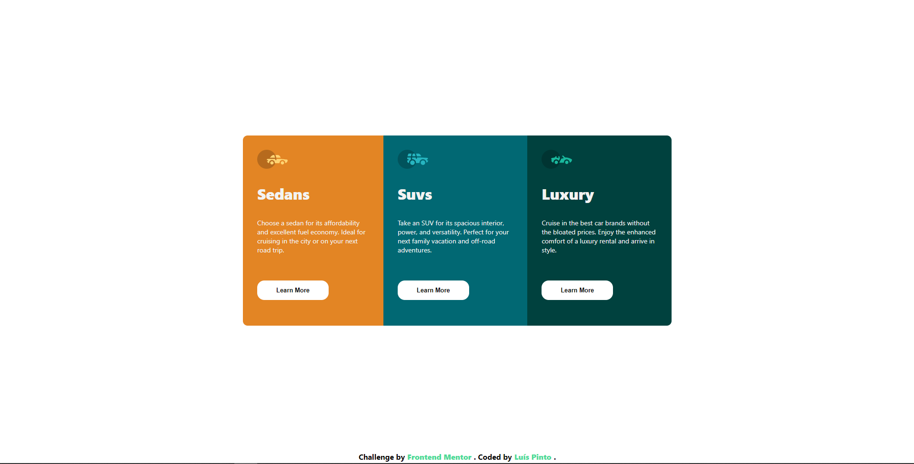

# Column Card App

# 

Just a quick challenge made for Frontend Mentor.

> Check it out: [https://FlashCodX.github.io/column-card-app/](https://FlashCodX.github.io/column-card-app/)

## Tech

- [React] - HTML enhanced for web apps!
- [CSS Modules] - Used to prevent class overlap.

## License

MIT

**Free Software, Hell Yeah!**

[react]: https://reactjs.org/
